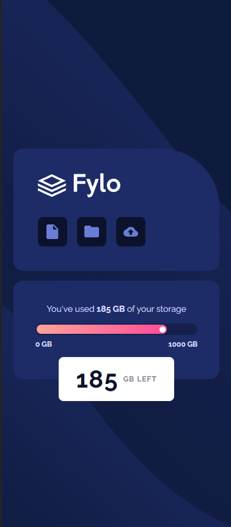
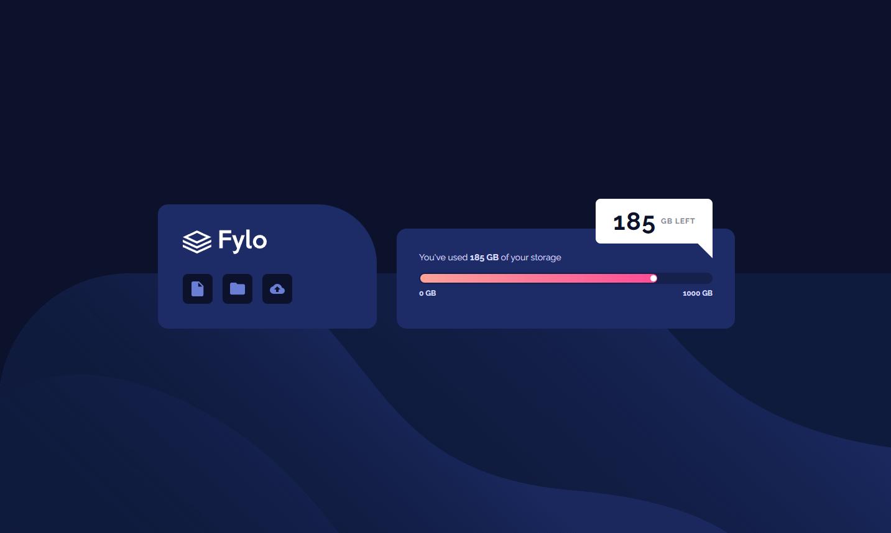

# Frontend Mentor - Fylo data storage component solution

This is a solution to the [Fylo data storage component challenge on Frontend Mentor](https://www.frontendmentor.io/challenges/fylo-data-storage-component-1dZPRbV5n). Frontend Mentor challenges help you improve your coding skills by building realistic projects.

## Table of contents

- [Overview](#overview)
  - [The challenge](#the-challenge)
  - [Screenshot](#screenshot)
  - [Links](#links)
- [My process](#my-process)
  - [Built with](#built-with)
  - [What I learned](#what-i-learned)
- [Author](#author)

## Overview

### The challenge

Users should be able to:

- View the optimal layout for the site depending on their device's screen size

### Screenshot

### Links

- Solution URL: [Add solution URL here](https://your-solution-url.com)
- Live Site URL: [Add live site URL here](https://your-live-site-url.com)

## My process

### Built with

- Semantic HTML5 markup
- Meter HTML Element
- CSS custom properties
- Flexbox
- CSS Grid
- Mobile-first workflow

### What I learned

This challenge was quite interesting. I debated over using a the \<progress\> or \<meter\> tag and decided to settle on the later and learn how to use it.

Positionning of the ball in the gauge was also tricky, I decided to position it with calc() using the percentage of the value minus some pixels. It allows for dynamic positioning through code later on.

The bubble was also new to me, not so much the positioning but the little notch in the desktop version.

## Author

- Frontend Mentor - [@Geelloo](https://www.frontendmentor.io/profile/Geelloo)
